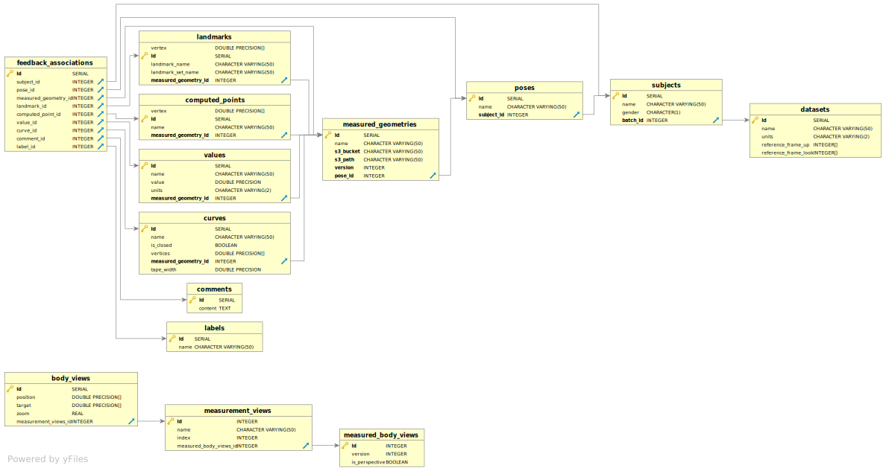

# goldie-data-layer

## Development

### System dependencies

On Fedora, install the following:

```sh
sudo dnf install perl-autodie.noarch perl-open.noarch
```

This is needed to get the `format:sql:check` and `format:sql:fix` npm scripts
to work.

### Github Package Registry authorization

1. Create a GitHub Personal Access Token with the `read:packages` scope.
2. Save the token in `~/.npmrc`:
   ```
   //npm.pkg.github.com/:_authToken=your-token-here
   ```
3. Run `npm ci` to check that it's working properly.

### Configuration

1. Copy `config/local.example.yml` to `config/local.yml`.
2. Uncomment one of the examples for `databaseUrl`.
3. To test with authentication, generate a shared secret and set it in
   `config/local.yml`.

The complete config schema is documented in `src/config-schema.js`.

### Starting the server

Start the server with `npm start`.

### Initializing a local PostgreSQL database

1. Install PostgreSQL and start it:

   ```sh
   brew install postgresql
   brew services start postgresql
   ```

2. Create the database:

   ```sh
   createdb goldie
   ```

3. Initialize the database:
   ```sh
   npm run load-seed-data
   ```

## Changing the schema

Change the schema by creating the appropriate SQL tables and foreign key
relationships. This is done in `src/ddl.sql`.

Sample data exists and can be added in either of two places: SQL or
JSON/JavaScript. The SQL is in `src/seed_data.sql` and the JavaScript is in
`src/scripts/load-seed-data.js`.

Apply them to your database by running `npm run load-seed-data`. If the
server is running, it will take note of the changes and automatically expose
new GraphQL endpoints.

#### Regenerate the ER diagram

Here is the ER diagram corresponding to the database schema:



The [ER diagram](resources/schema.svg) is generated with [DBVisualizer Free edition](https://www.dbvis.com/download/11.0).

You can configure it as follows:

1. Set up the local PostgreSQL connection:


2. Navigate to `public -> TABLE`, and go to `References` tab:


Click this export button, choose SVG, and type in the full path to export to `schema.svg`:


In the future, we would like to generate this programmatically via CLI.

## Deployment

In deployed environments, you can configure the server using the environment
variables listed in `config/custom-environment-variables.yml`.

[**On every deploy**, including e.g. configuration changes][when], the app's
database is reset using the checked-in seed data.

[when]: https://devcenter.heroku.com/articles/release-phase#when-does-the-release-command-run

### Review apps

Heroku is configured to create [review apps][] every time a PR is opened.
When the app is created, an ephemeral Heroku Postgres database is created
along with it. After each commit pushed to the branch, Heroku redeploys the
review app &ndash; which includes resetting the database using the checked-in
seed data.

You can develop against a review app by pointing your database URL to it.

[review apps]: https://devcenter.heroku.com/articles/github-integration-review-apps
